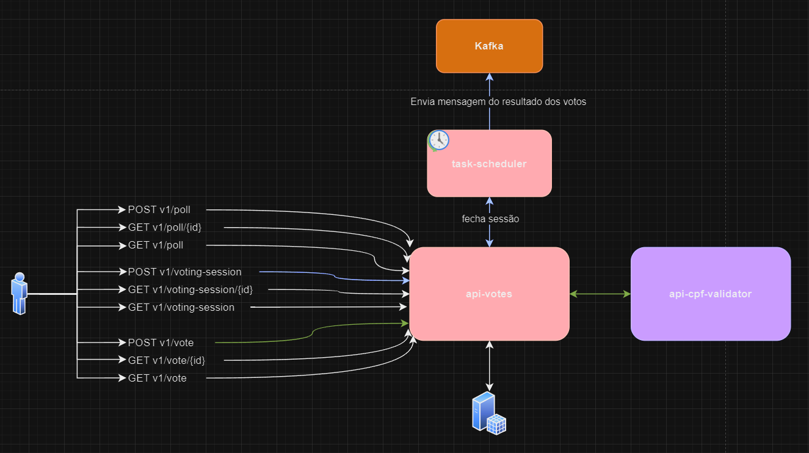

# Introdução
Esta API é projetada para gerenciar pautas com seus respectivos votos e sessões de votação.
Ela fornece endpoints para criar e visualizar pautas, votos e sessões de votação, bem como para votar em uma determinada sessão.

## Funcionalidades Principais
- Pautas: Os usuários podem criar e visualizar pautas.
  - Uma pauta poderá somente ter uma sessão que poderá ser aberta uma única vez.
- Sessões: Os usuários podem criar e visualizar sessões de votação.
  - O usuário só poderá abrir uma sessão para uma pauta específica.
- Votos: Os usuários podem votar em uma pauta de votação específica.
  - O usuário só poderá votar uma vez por cpf e somente quando a sessão de votação estiver aberta.

# Instalação
1. Clone o repositório:
`git clone https://github.com/willianpitz/desafio-back-votos.git`
2. Instale as dependências:
`mvn clean && mvn install` ou `mvn clean ; mvn install`
3. Execute o Docker na raiz do projeto:
`docker-compose up`

# Comandos

## Subir as aplicações localmente
Execute o comando:
`mvn spring-boot:run`

## Gerar relatório de cobertura de testes
Execute o comando no terminal desejado:

### Windows Powershell:
`mvn clean package ; mvn verify ; mvn jacoco:report`

### Outro Terminal:
`mvn clean package && mvn verify && mvn jacoco:report`

# Documentação de API
- api-votes: http://localhost:8085/swagger-ui.html

- api-cpf-validator: http://localhost:8086/swagger-ui.html

# Acessar o Kafka:
http://localhost:18080/

# Tecnologias Utilizadas

- Java
- Spring Boot
- Spring Webflux
- Kafka
- PostgreSQL
- Docker

# Requisitos técnicos

Para build e executar a aplicação localmente você precisa de:
1.	JDK 17
2.	Maven 3

# Observações:

### api-votes
- Para fins de simplificar o exercício, esta API não possui nenhuma camada de segurança, não sendo necessário o uso de Tokens para acesso a mesma.
- O CPF está sendo retornado completo para simplificar o entendimento, porém seria um uso mais adequado retorna-lo mascarado ou criptografado.

## Integrações

### api-cpf-validator:
No Desafio proposto foi solicitado uma integração com um serviço que verifique a partir do CPF do associado se ele pode votar.
Esta api deveria a partir de um CPF retornar ABLE_TO_VOTE ou UNABLE_TO_VOTE. Porém, como a API disponibilizada se encontrava indisponível
foi criada uma nova API para validar apenas se o CPF é valido ou não. Sendo responsabilidade da API de votos gerenciar se o CPF pode ou não votar.

# Diagrama da solução:
